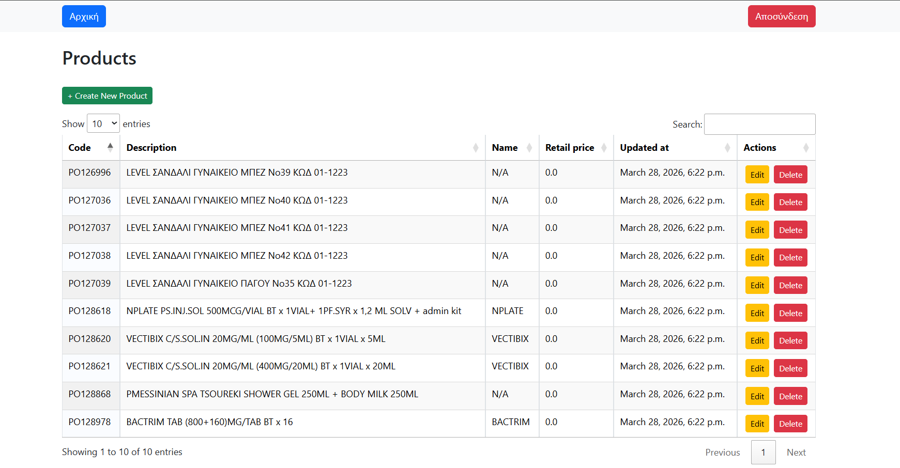
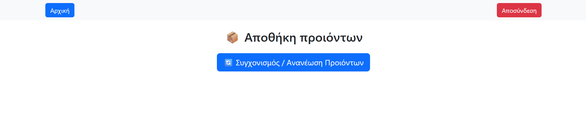
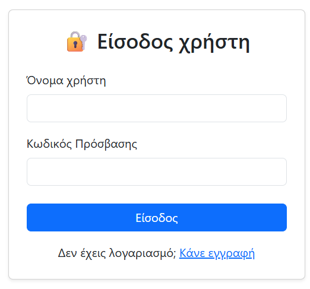
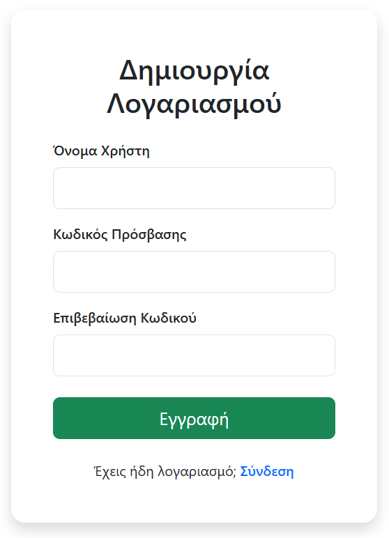

# Django ERP Product Bridge 🚀

A production-style Django application that synchronizes a local product database with external ERP system (private API integration).
Designed to demonstrate data consistency, API integration, and resilient backend architecture.

---

## 🌟 Key Features

* **Data Synchronization Engine**

  * Fetches product data from an external ERP API
  * Uses `update_or_create` (UPSERT) logic
  * Ensures the local database always reflects the current state of the ERP

* **Automated Data Pruning**

  * Removes products that are no longer returned by the API
  * Guarantees **1:1 consistency (mirror behavior)** between ERP and local DB

* **Fallback Mechanism (High Availability)**

  * If the API is unavailable or returns empty data (e.g. Sundays)
  * Automatically falls back to a local `mock_products.json`

* **Secure Configuration**

  * Environment-based settings using `.env`
  * Sensitive data (API URL, secrets) excluded from version control

* **Authentication System**

  * Login / Logout flow
  * Protected routes (`/home`, `/products`)

* **Dynamic Product Table**

  * Built with jQuery DataTables
  * Supports search, sorting, pagination

* **Full CRUD Functionality**

  * Create, edit, delete products
  * Form validation included

---

## 📸 Application Screenshots

### 1. Product Management Dashboard
*Full CRUD interface with DataTables integration (Search, Sort, Pagination).*



<br>

### 2. Product Synchronization
*The core trigger that fetches and syncs data from the external ERP API.*



<br>

### 3. Secure Authentication
*User login and registration for protected access.*

<table width="100%">
  <tr>
    <td align="center" valign="top" width="50%">
      <strong>Login Screen</strong><br><br>
      
    </td>
    <td align="center" valign="top" width="50%">
      <strong>Registration Screen</strong><br><br>
      
    </td>
  </tr>
</table>

---

## 🛠️ Tech Stack

* **Backend:** Python 3.12, Django
* **Frontend:** HTML, Bootstrap, jQuery, DataTables
* **Database:** SQLite
* **API Integration:** `requests`
* **Environment Management:** `python-dotenv`

---

## ⚙️ Installation & Setup

### 1. Clone the repository

```bash
git clone https://github.com/Anastasis-Loukas/Django-ERP-Product-Bridge.git
cd Django-ERP-Product-Bridge
```

---

### 2. Create virtual environment

```bash
python3 -m venv venv
source venv/bin/activate  # Linux / WSL
venv\Scripts\activate     # Windows
```

---

### 3. Install dependencies

```bash
pip install -r requirements.txt
```

---

### 4. Setup environment variables

Create a `.env` file in the root directory:

```env
EXTERNAL_API_URL=https://your-api-url-here
```

---

### 5. Run migrations

```bash
python manage.py migrate
```

---

### 6. Create superuser (optional)

```bash
python manage.py createsuperuser
```

---

### 7. Run the server

```bash
python manage.py runserver
```

---

## 🔄 How Synchronization Works

1. User clicks **"Sync Products"**
2. Application calls external ERP API
3. System:

   * Updates existing products
   * Inserts new ones
   * Deletes products no longer present in API
4. UI refreshes with latest data

📌 Result: Local database is always aligned with ERP snapshot.

---

## ⚠️ API Note

This project was originally integrated with a **private ERP API**.

For confidentiality reasons:

* The real API endpoint is **not included**
* A local mock file (`mock_products.json`) is provided for demonstration

---

## 📁 Project Structure (simplified)

```
Django-ERP-Product-Bridge/
│── accounts/                  # authentication
│── products/                  # product management & ERP sync
│── templates/                 # global templates
│
│── Django-ERP-Product-Bridge/ # project settings
│
│── manage.py
│── requirements.txt
│── .env.example
```

---

## 🧠 Design Decisions

* Used **atomic transactions** to ensure DB consistency
* Implemented **UPSERT + DELETE strategy** instead of naive inserts
* Added **fallback mechanism** to simulate real-world API instability
* Chose simplicity in UI to focus on backend correctness

---

## 🚀 Future Improvements

* Background sync with Celery / Cron jobs
* REST API exposure (Django REST Framework)
* Docker containerization
* PostgreSQL migration
* Unit & integration testing

---

## 👤 Author

**Anastasis Loukas**

* GitHub: https://github.com/Anastasis-Loukas
* Project: Django-ERP-Product-Bridge

---
